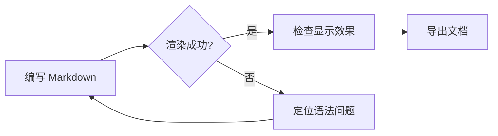
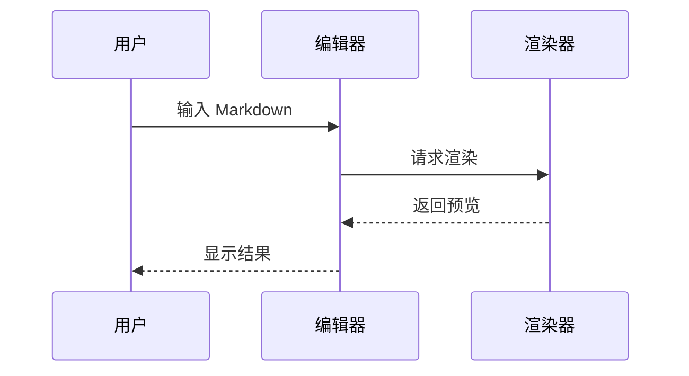
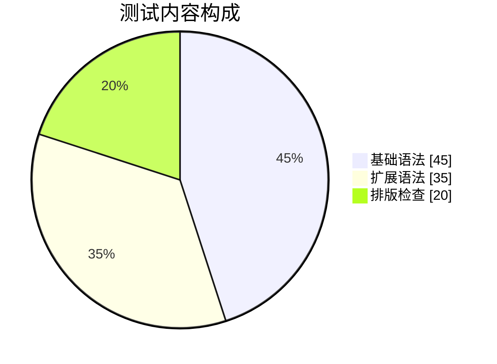

[TOC]

# Markdown 渲染综合测试

> 本文用于检查 Markdown 编辑器的语法解析、排版、主题样式、滚动行为和导出效果。建议同时观察编辑态与预览态。

**测试范围：** CommonMark 常用语法、GFM 扩展、数学公式、图表、HTML 与中英文混排。

---

## 1. 标题层级与段落

# 一级标题

## 二级标题

### 三级标题

#### 四级标题

##### 五级标题

###### 六级标题

标题下划线形式：

# 标题式二级标题

## 标题式三级标题

普通段落可以包含中文、English、数字 12345、标点！？，以及混合内容。Markdown 的段落通常由空行分隔。这个段落比较长，用于观察窄屏时的自动换行、行高、字距和中英文混排表现：The quick brown fox jumps over the lazy dog. 这里再加入一些内容，看看连续文本在预览区域中的布局是否自然。

这一行用行尾两个空格实现硬换行。  
这是硬换行后的第二行。

这一行通过反斜杠实现硬换行。  
这是下一行。

---

## 2. 行内文本样式

- **粗体文本** 与 **下划线形式粗体**
- *斜体文本* 与 *下划线形式斜体*
- ***粗斜体文本***
- ~~删除线文本~~
- `行内代码`：`const answer = 42`
- 普通文本中的 `中文代码`、`a < b && c > d`
- 上标：x^2^、E = mc^2^
- 下标：H~2~O、CO~2~
- 高亮（扩展语法）：==重点内容==
- 插入（扩展语法）：++新增文本++
- 键盘按键：<kbd>⌘</kbd> + <kbd>S</kbd>

组合格式：**粗体中包含 `代码`**，以及 *斜体中包含 [链接](https://example.com)*。

转义字符：\*星号不会触发斜体\*、\_下划线不会触发斜体\_、# 不会成为标题、\ 显示反斜杠。

---

## 3. 引用与提示块

> 这是普通引用段落。
>
> 引用内可以有多个段落，也可以使用 **粗体**、`代码` 和链接。
>
> - 引用中的列表项
> - 另一个项目
>
> ```text
> 引用中的代码块
> ```

> 嵌套引用的外层。
>
> > 这是第二层引用。
> >
> > > 这是第三层引用。

> \[!NOTE]
>
> 这是 NOTE 提示块，用于检查信息提示样式。

> \[!TIP]
>
> 这是 TIP 提示块，也可以包含 **强调** 和链接。

> \[!IMPORTANT]
>
> 这是 IMPORTANT 提示块。

> \[!WARNING]
>
> 这是 WARNING 提示块。

> \[!CAUTION]
>
> 这是 CAUTION 提示块。

---

## 4. 列表

### 无序列表

- 苹果
- 香蕉
  - 迷你香蕉
  - 另一种香蕉
    - 更深一层
- 橙子

不同标记也可用于无序列表：

- 星号项目

* 加号项目

### 有序列表

1. 第一步
2. 第二步
   1. 子步骤 A
   2. 子步骤 B
3. 第三步

从指定序号开始：

7. 第七项
8. 第八项

### 任务列表

- [x] 已完成事项
- [ ] 待处理事项
- [ ] 包含 **格式** 的待办事项
  - [x] 已完成的子任务
  - [ ] 未完成的子任务

### 列表中的段落与引用

1. 第一项可以包含多个段落。

   这是第一项的第二段。

   > 这是第一项中的引用。

2. 第二项。

---

## 5. 代码

行内代码：`npm run build`、`path/to/file.md`、`<Tag />`。

### 带语言标识的代码块

```javascript
function greet(name = "世界") {
  return `你好，${name}！`;
}
console.log(greet());
```

```typescript
interface User {
  id: number;
  name: string;
  active: boolean;
}

const users: User[] = [{ id: 1, name: "小明", active: true }];
```

```python
def fibonacci(n: int) -> list[int]:
    values = [0, 1]
    while len(values) < n:
        values.append(values[-1] + values[-2])
    return values[:n]

print(fibonacci(8))
```

```rust
fn main() {
    let greeting = "你好，Rust！";
    println!("{greeting}");
}
```

```json
{
  "name": "markdown-rendering-test",
  "enabled": true,
  "items": [1, 2, 3]
}
```

```bash
# shell 注释与命令
printf '%s\n' "Hello, Markdown"
```

### 无语言标识与围栏形式

```
没有指定语言的代码块
检查等宽字体、背景色和横向滚动。
```

```text
波浪线围栏代码块
```

### 缩进代码块

```
这是由四个空格缩进的代码块。
第二行保持原有缩进。
```

### Diff 代码

```diff
- 删除的旧行
+ 新增的新行
  保持不变的行
```

---

## 6. 表格

| 左对齐               |            居中对齐           |    右对齐 | 默认对齐 |
| :---------------- | :-----------------------: | -----: | ---- |
| 普通文本              |           **粗体**          | 123.45 | 默认内容 |
| `行内代码`            | [链接](https://example.com) |     -9 | 中文内容 |
| 较长的单元格内容，用于观察换行效果 |            第二列            |      0 | 最后一列 |

表格也可以包含转义的竖线：

| 表达式      | 说明        |
| -------- | --------- |
| `a \| b` | 竖线不会拆分单元格 |
| x < y    | HTML 实体   |

---

## 7. 链接、图片与自动链接

- 行内链接：[OpenAI](https://openai.com)
- 带标题的链接：[示例站点](https://example.com "鼠标悬停提示")
- 自动链接：<https://example.com/path?q=markdown>
- 邮箱链接：<mailto:hello@example.com>
- 裸网址：<https://example.com>
- 引用式链接：[Markdown 官网][md]
- 同页锚点：[跳转到数学与图表](#10-数学与图表)

[md]: https://daringfireball.net/projects/markdown/ "Markdown 参考"

图片替代文本检查（资源不存在时应显示 alt 文本）：


带链接的图片：

[](https://example.com)

---

## 8. 脚注与定义列表

这里有一个脚注引用[^1]，以及另一个脚注[^2]。

术语表（部分解析器支持定义列表）：

Markdown
: 一种轻量级标记语言。

渲染器
: 将 Markdown 源码转换为 HTML 或其他展示格式的工具。

---

## 9. 数学公式

行内公式：$E = mc^2$、$a^2 + b^2 = c^2$、$\alpha + \beta = \gamma$。

块级公式：

$$
\int_0^1 x^2\,dx = \frac{1}{3}
$$

矩阵：

$$
\begin{bmatrix}
1 & 2 \\
3 & 4
\end{bmatrix}
\begin{bmatrix}
x \\
y
\end{bmatrix}
=
\begin{bmatrix}
x + 2y \\
3x + 4y
\end{bmatrix}
$$

---

## 10. 数学与图表

### Mermaid 流程图



### Mermaid 时序图



### Mermaid 饼图



---

## 11. HTML 与特殊字符

HTML 行内标签：<kbd>Ctrl</kbd>、<sup>上标</sup>、<sub>下标</sub>、<mark>标记文本</mark>。

字符实体：&、<、>、"、©、 。

<details>
<summary>点击展开：折叠内容</summary>

折叠区域内可以包含段落、列表和代码：

- 第一项
- 第二项

```text
隐藏区域中的代码
```
</details>

<div style="border: 1px solid #888; padding: 0.75em; border-radius: 0.5em;">
<strong>HTML 块：</strong>用于检查原始 HTML 的解析或过滤策略。
</div>

---

## 12. 分隔线与连续标点

下面分别使用不同形式的水平线：

---

---

---

连续标点与特殊符号：—— … 「中文引号」『书名号』 · • → ← ✓ ✗ ★ ☆ © ® ™。

---

## 13. 长内容与边界情况

特别长的英文单词：pneumonoultramicroscopicsilicovolcanoconiosis

特别长的路径：`/this/is/a/very/long/path/that/might/need/horizontal/scrolling/or/wrapping/in/a/narrow/editor/window`

含多个连续空格的普通文本：甲　乙（全角空格）、甲   乙（不换行空格）。

空行与段落间距检查：

上方是一个段落。


上方空出多行，但 Markdown 通常会将它们折叠成段落间距。

## 14. 任务核对清单

- [x] 标题、段落、强调、引用和分隔线
- [x] 列表、任务列表、代码块和表格
- [x] 链接、图片、脚注和公式
- [x] Mermaid、HTML、转义与特殊字符
- [ ] 在不同主题、窗口宽度与导出格式下复核

---

[回到文档开头](#markdown-渲染综合测试)

[^1]: 脚注内容可以包含 **粗体**、`行内代码` 和链接。

[^2]: 脚注也可以有较长的内容，用来检查脚注区的行距、编号和回跳链接。

